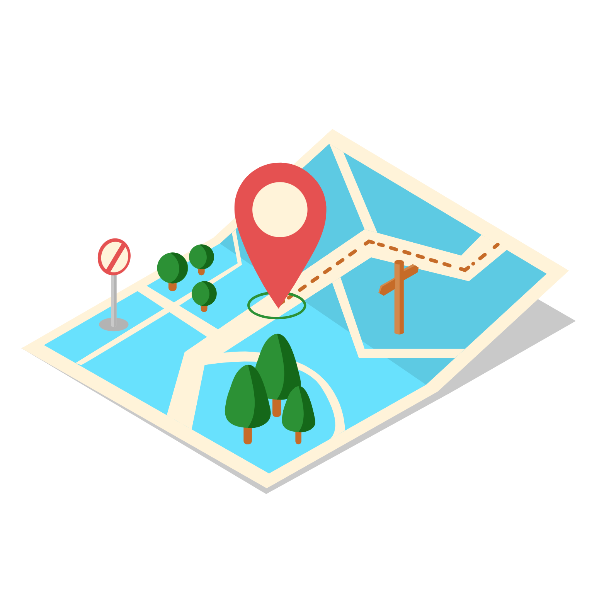

<h1 align="center">Geo-Finder</h1>

<p align="center">

</p>

<p align="center">


</p>

--------

Geo-Finder is a java project that offers a variety of rest services.  
The project is developed using SpringBoot and allows you to extract data from a geospatial database.

## Features
* Get the polygon of the place you want, such as a region, province, etc.
* Get the hierarchy of one or more places you want given input coordinates.

## Configuration
To configure the connection to the database it is necessary to set the parameters in the application.properties file.  
Within the same file you can configure the Sentry dsn to be able to monitor your service.  
The parameters to be configured are shown below:

```properties
spring.datasource.url=database connection url
spring.datasource.username=database username
spring.datasource.password=database password
spring.datasource.driver-class-name=database driver class name

sentry.dsn=sentry dsn
```

## Polygon Service
The polygon extraction service allows you to obtain the polygon of a region, province, municipality or settlemet.  
To obtain the polygons it is possible to make two types of requests:

```http request
GET /polygon/description/{level}?name={location-name}&iso3={country-code}
```
```http request
GET /polygon/coordinates/{level}?longitude={longitude}&latitude={latitude}
```

The levels that can be chosen are: `region`, `province`, `municipality` and `settlement`.  
Below are examples of the service's response whether the polygon is found or not.

```json
{
    "coordinates": [
        [
            [
                [
                    44.93658,
                    9.29037
                ],
                [
                    44.93657,
                    9.29027
                ],
                [
                    44.93678,
                    9.29022
                ],
                [
                    44.93699,
                    9.29044
                ],
                [
                    44.93661,
                    9.29078
                ],
                [
                    44.93658,
                    9.29037
                ]
            ]
        ]
    ],
    "status": {
        "code": 0,
        "description": "Polygon found"
    }
}
```
```json

{
    "coordinates": [],
    "status": {
        "code": 1,
        "description": "Polygon not found"
    }
}
```

## Hierarchy Service
The hierarchy service allows you to obtain the hierarchy of one or more places given input coordinates.  
The request to execute is the following:

``` http request
POST /finder/{level}
```

The levels that can be chosen are: `pointAddress`, `hospital`, `institute`, `parking` and `shopping`.  
While the parameters that can be passed in the body are the following:

```body
{
    "longitude": X coordinate
    "latitude": Y coordinate
    "candidates": Number of candidates to extract
}
```
Below is an example of a service response.

```json
{
    "candidates": [
        {
            "level": "hospital",
            "iso3": "ITA",
            "longitude": 11.35501,
            "latitude": 44.981,
            "distance": 7.3198885402305764,
            "hierarchy": {
                "region": "LOMBARDIA",
                "province": "MANTOVA",
                "municipality": "SERMIDE E FELONICA",
                "settlement": "FELONICA",
                "streetType": "VIA",
                "streetName": "GIUSEPPE GARIBALDI",
                "street": "VIA GIUSEPPE GARIBALDI",
                "postcode": "46028",
                "houseNumber": "113"
            },
            "other": {
                "place": "DR. NAGLIATI MARIA COSTANZA",
                "phoneNumber": "0386916182"
            }
        }
    ],
    "status": {
        "code": 0,
        "description": "Geo elements found"
    }
}
```